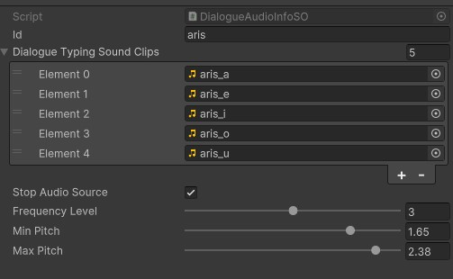

# Untitled 2.5 Platformer

## Overview
A 2.5D game that is a work in progress

## Table of Contents

- [Game Concept](#game-concept)
- [Gameplay](#gameplay)
- [Features](#features)
- [Game Mechanics](#game-mechanics)
- [Artwork](#artwork)
- [Art Direction](#art_direction)
- [Sound and Music](#sound-and-music)
- [Platform and Technology](#platform-and-technology)
- [Controls](#controls)
- [Installation](#installation)

## Game Concept

Reimagining an old game with modern gameplay mechanics using the Unity Engine. 
 1. [Placeholder: Provide Story/Setting]
 2. [Placeholder: whats the player's goal]
 3. [Placeholder: differences from the old game, improvements etc]

## Gameplay

 [Placeholder: Provide how the player progresses, level design etc]

## Features

 1. **Dialogue System** (18 Nov 2023)
    Fully customizable dialogue system that uses the **inkle** scripting language.
     * Typing effect
     * Skipping to end of line
     * portrait tags
     * speaker name tags
     * audio tags (using Scriptable Object)
     * layout tags
     * rich text for coloring different works with meaning (eg. locations)
     * multiple choices

## Game Mechanics

 **Movement** is done in a 2-axis fashion using front-back / left-right animations. There
 is support for jumping/crouching so we have to implement those in-game in some manner on the
 level design.
 **Combat** is done probably using left click to attack for now. Future enhancements could be dodging
 blocking etc...

## Artwork
 Primarily made by us

 1. Player is using a [link spritesheet](https://www.deviantart.com/gregarlink10/art/Link-Ocarina-of-Time-UPDATED-868055542). Very few of the animations have been used, we will be adding more in time.

 2. **Modular Interior House Pack**: 105 Low Poly assets for primary use in interior spaces. All assets are made to be modular in 2x2m tile.
    * 5 Wooden Beams
    * Flooring + 15 different Wall Models (Wood + Stone)
    * 3 Wardrobe Assets, 1 bed, 1 pillow, 2 sacks
    * Torch, 2 lanterns and 3 candles
    * 2 Slim (1m width) Wooden walls + 3 Short (0.25m height) wooden walls
    * 2 carpets, 1 door, 1 wooden railing
    * Fireplace + 2 lumber assets
    * 2 Hanging Cloths + Curtains
    * 4 different cupboards + 2 jugs, 2 plates, 3 cups, 3 bottles, 3 bowls, 4 pots + leaves
    * 2 Windows, 3 ladders, 1 shed
    * 1 chest, 1 crate, 2 barrels, 1 basket
    * 2 tables, 2 chairs, 3 stools, 2 bars
    * 10 different book assets, (single, stacks and multiple)

3. **Modular Exterior House Pack**: TODO (mostly stuff for homes/towns)
4. **Modular Environment Pack**: Trees, Stones, Cliffs etc (will be used for overworld and caves/beaches)

## Art Direction

* **2.5D perspective**:
Characters and NPCs will be 2D spritesheet with (probably) 2-axis movement and animations. The rest of the world is 3D low poly

* **SreenSpace Cavity**:
A ScreenSpace cavity renderer feature. Allows highlighting of mesh edges to make assets pop a bit more (since its low poly). Replicates what blender cavity option does.
    1. Main renderer feature is in ScreenSpaceCavity/Shaders/**Cavity**. Place onto the URP Renderer Data (options to configure in there)
    2. Custom **ToonyLight** shader in ShaderPack/Shaders that can be used on any asset to enable the effect.

* **Mixed GI**:
    * Bake Lightmaps for each scene. Set static all object that are not movable and generate the lightmap. Settings can be tweaked.

    * a Light probe group is used to sample the lightmap on different points and display that on dynamic objects. WIP: Still need to apply that to 2D sprites.

* **Post-Process**:
    * Each scene contains a Global_PPV (Global volume with a post process profile slapped on). All Post process settings are contained there (Tonemapping, Bloom etc...)

    * For specific scenarios a Local_PPV can be created to make custom setups for different areas.

## Sound and Music

1. Dialogue has animal crossing style sounds (using vowels and different pitch and played frequency of each sound. New AudioSO (Scriptable Objects) can be easily made using the Assets/NPCs/Dialogue/Audio/DialogueAudioInfoSO.cs script)

## Platform and Technology

    * Unity Engine
    * Windows

## Controls
Standard Inputs used by most games, Scheme can be changed from the options (in the future)
For now:
    1. WASD -> Movement
    2. Left click -> Attack
    3. E -> Interact

## Installation

 [Placeholder: will see]

## User Interface (UI)

1. <u>Main Menu</u>: Main Menu is the first scene to be loaded when the game is started. It has 3 buttons:
    * Start Game: this button transitions to another menu which is called the save slot menu, it contains 3 possible save slot that a new game can be created or an already existing one can be loaded. If the save slot is occupied, it contains some information about the point where the game was saved. It also contains a delete button to delete the last hovered save slot, prompting the user via a confirmation popup.
    * Options: contains options to change some aspects about the game quality, sound and video settings (possible to change keybindings in the future)
    * Exit Game: create a confirmation popup to ask the user if he really wants to quit the game or not.
2. <u>Pause Menu</u>: //TODO

## System Explanation

* **SINGLETONS**:
    1. <u>GenericSingleton.cs</u>: the generic singleton class that all singletons should derive from. It just makes sure that only 1 instance exists and if accessible globally.
    2. <u>CameraManager.cs</u>: manager script that should contain any methods that manipulate the camera position and attributes
    3. <u>DialogueManager.cs</u>: explained in the dialogue section
    4. <u>InputManager.cs</u>: contains all input events in the form of C# functions that are then mapped to the Player Input and contain methods to get the input values.
    5. <u>GameManager.cs</u>: contains a LoadScene() method that should be used when loading a scene. It's important to use this method so that the data persistence doesn't break. Also contains a Timer() method that keeps how much time the game has been played.
    6. <u>DataPersistenceManager</u>: explained in the data persistence section

* **Player**:
    1. <u>PlayerController.cs</u> -> controls how the player falls, what is ground etc.. (Brackeys)
    2. <u>PlayerMovement.cs</u> -> attack range, movement speed, attack damage... stuff like that (Brackeys)
    3. <u>Interactor.cs</u> -> handles when the InteractionCanvas is shown if an interactable object is near.
    4. <u>CircleWipeTransition.cs</u> -> handles scene transition using a custom HLSL shader (SG_MaskTransition),
    invoke by calling the StartTransition method with a string of the level name.

* **Interactables**:
Could be stuff like doors, tables etc... depending on the scope the game will take. All interactable objects
implement the interactable interface to get the prompt texts and the action.
    1. <u>Door.cs</u> -> press e to open a door and trigger a scene transition to an interior level
    2. <u>DialogueTrigger.cs</u> -> press e to start a conversation with an NPC.

* **Dialogue**:
    * How to Setup a new NPC:
    get the NPC prefab, inside the DialogueTrigger script, put an ink JSON (compiled) file that includes the story of an NPC. Example of an ink file:
    
        * choices are made with + symbol (inside [] the text of the choice)
        * tags can be place with #key: value
        * color can be placed with rich text like"<color=\\#FF0000>test<\/color> (this will make the test word red.)
        * portraits should be placed as an animation inside the PortraitAnimator (just place the image in the first frame of an animation with the same name as the one in the ink tag )
        * more layouts can be made if needed
        * audio can be made using a new Audio Scriptable Object. The important part is to have the id be the same name as the audio tag. The SO object should also be placed in a list in Dialogue Manager under Audio. Example SO looks like this:
        

    * How the Dialogue system is made:
        1. <u>DialogueManager.cs</u> - **SINGLETON CLASS** -> handles how the story of a specific npc is parsed with methods like DisplayLine(), ContinueStory(), HandleTags() etc that when used together can parse an ink JSON file that contains the story of an npc.
        2. <u>DialogueVariables.cs</u> -> handles global variables that can be set and used by multiple npcs. the variables are stored inside the globals.ink file that is included in other ink files that need to use it. The variables are saved in PlayerPrefs for now (TODO: needs to change)

* **Data Persistence**:
    This section explains how the loading/saving of the game works.
        1. <u>DataPersistenceManager.cs</u> - **SINGLETON CLASS** -> handles how and when data needs to be persisted to the file system. The base methods are NewGame() which creates a new GameData object, LoadGame() which loads a game by specifying a profile ID and SaveGame() which saves the game to the path: *C:\Users\{user}\AppData\LocalLow\{companyName}\{projectName}\{profileID}\data.json*
        for windows platform. In this directory a backup of the game data also exists in case of corruption. There is also an enumerator that auto saves the game every x seconds that can be configured and game is also saved OnApplicationQuit()
        2. <u>FileDataHandler.cs</u> -> an abstraction layer that handles the saving and loading to and from file system. It contains all functions that interface with a file system. Works for PC platforms but if for example you wanted to make the game for mobile, you would need to create a CloudDataHandler in order to save to cloud. Implements the methods: Save, Load, Delete, EncryptDecrypt, AttemptRollaback (names are self-explanatory)
        3. <u>IDataPersistence</u> -> interface that contains a SaveData and LoadData methods that all classes that implement the interface need to call.
        4. <u>GameData</u> -> Base class that holds the data for the game that need to be saved/loaded. It has the default values that are saved when a new GameData object is made.
        5. <u>SerializableDictionary</u> -> contains an extension of the default C# Dictionary class that can be serialized using JSON.utility in order for dictionary objects to be persisted on disk.