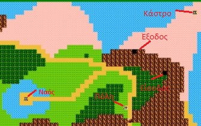

# Legend of Zelda: Adventures of Link
### Εισαγωγή
Το αντικείμενο αυτής της εργασίας είναι η υλοποίηση και ο εκσυγχρονισμός του παιχνιδιού που κυκλοφόρησε το 1987. Τα κύρια στοιχεία του εκσυγχρονισμού είναι τα παρακάτω:
 * Υλοποίηση σε 3D μοντέλο
 * Πιο μοντέρνα και διαδραστικά γραφικά
 * Υλοποίηση τεχνητής νοημοσύνης για NPC με σύγχρονες αρχιτεκτονικές
 * 

## Ροή παιχνιδιού
### Main Menu
Αρχικά στον παίχτη παρουσιάζεται η αρχική οθόνη η οποία περιέχει 3 επιλογές:
 #### 1. Start
 Μετάβαση στην οθόνη επιλογής ενός από τα τρία Save Slot. Αν επιλεχθεί κάποιο κενό ξεκινάει νέο παιχνίδι ενώ αν επιλεχθέι κάποιο με ήδη αποθηκευμένα δεδομένα το παιχνίδι ξεκινάει αναλόγως. 
 #### 2. Options
 Μετάβαση στην οθόνη ρυθμίσεων που θα περιέχει:
* Ρύθμιση έντασης ήχου
* Ρύθμιση ποιότητας γραφικών (Low/Medium/High)
* Control Customization
 #### 3. Quit
 Εμφάνιση παραθύρου επιβεβαίωσης τερματισμού παιχνιδιού (Are you sure you want to quit? Yes/No)

### Ναός
Το παιχνίδι θα ξεκινά από τον ναό ο οποίος θα είναι μια αντίστοιχη αναπροσαρμογή του ναού στο original παιχνίδι. Κάνοντας interact με την Zelda ξεκινάει ένας διάλογος που θα εξιστορεί τον γενικό σκοπό του παίχτη (Link) καθοδηγόντας τον να εξερευνήσει τον κόσμο.

### Overworld
Βγαίνοντας από τον ναό η σκηνή αλλάζει στο overworld που είναι και το μεγαλύτερο κομμάτι του παιχνιδιού. Σε όλο το overworld, ο παίχτης είναι ελεύθερος να εξερευνήσει την περιοχή, ενώ καλείται να αντιμετωπίσει κάποια εχθρικά NPC που εμφανίζονται κοντά του. Θα υπάρχουν 2 είδη, με διαφορετικά χαρακτηριστικά το καθένα και διαφορετική συχνότητα εμφάνισης. Ο παίχτης έχει την επιλογή να τα αποφύγει αν θέλει, αλλά χάνει exp με αποτέλεσμα να είναι πολύ πιο δύσκολο να ολοκληρώσει τις υπόλοιπες αποστολές.
#### 1. ????
#### 2. ????  
Το overworld περιέχει:
* Εξωτερικό κομμάτι του ναού
* Πόλη
* Σπηλιά
* Dungeon (Κάστρο)

Το overworld οριοθετείται από απότομα βουνά, την θάλασσα, πεσμένους κορμούς, βράχους και άλλα εμπόδια. 

### Πόλη
Στην πόλη υπάρχουν διάφοροι NPC χαρακτήρες που περιφέρονται, μπορούν να ανοίξουν τις πόρτες των σπιτιών και να μπουν ή να βγουν από αυτά. Ο παίχτης μπορεί να μιλήσει σε όλα τα NPC, τα περισσότερα θα έχουν ένα συγκεκριμένο ρεπερτόριο προτάσεων εκτός από αυτά που θα έχουν συγκεκριμένο ρόλο, σημαντικό για την ιστορία του παιχνιδιού. Τα σημαντικά NPC είναι:
#### 1. Ο γέροντας
#### 2. Νοσοκόμα
#### 3. Σιδηρουργός

### Σπηλιά
Η σπηλιά θα είναι αναπόφεκτο κομμάτι της διαδρομής του παίχτη για να ολοκληρώσει την αποστολή που του έδωσε ο γέροντας. Θα είναι ένα στενό μονοπάτι, σχετικά σκοτεινό ώστε να είναι πολύ δυσκολότερο για τον παίχτη να αποφύγει μια μάχη. Αν ο παίχτης δεν έχει κάνει ανέβει επίπεδο, οι μάχες στην σπηλιά θα είναι αρκετά πιο δύσκολες. Εκεί θα εμφανίζονται τα NPC:
#### 2. ????
#### 3. ????

### Κάστρο
Το κάστρο θα είναι η πιο δύσκολη περιοχή που θα αντιμετωπίσει ο παίχτης, με πολλά δωμάτια που μπορεί να εξερευνήσει τα οποία δεν οδηγούν σειριακά στο δωμάτιου του Boss.

AI -a
Fix PlayerController -d
Finish save/load and menu -a
Fix Combat -d
Add abilities
Very basic level system -a -d
Quest logic -d
------------------------------------
3D packs -a d?
Fix sprites (pixellab.ai ?)
Royalty free sound + audio manager
----------------------------------
Scene 1: Temple
Scene 2: Overworld (town, nature)
Scene 3: Cave
Scene 4: Dungeon
Extra Scenes: Interiors
Terrain
-----------------------------
Inventory
Economy
Expanded level system

